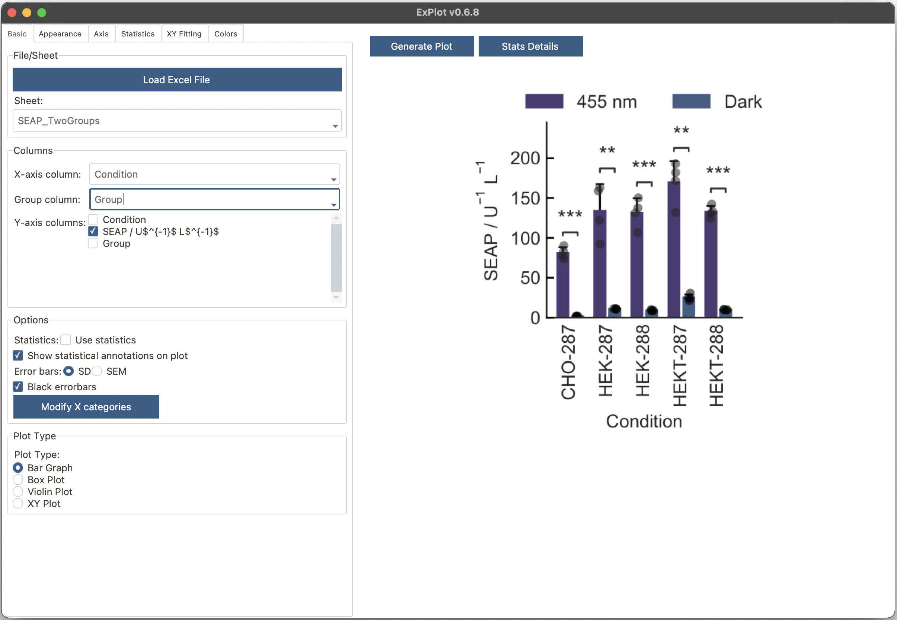

# ExPlot
A modern cross-platform Python/Tkinter app to plot data from Excel sheets using *seaborn* and *matplotlib*, featuring theming with ttkbootstrap. Fully developed with Claude 3.7 Sonnet, Cascade Base, SWE-1, and GPT-4.1 using Windsurf.

No warranty is given or implied. Use at your own risk and after testing and validation of functionality.



Demo video:

https://github.com/user-attachments/assets/10612e7a-778d-43c2-8e92-4ea0c66b7106

# macOS error

If you face this error on macOS, proceed as follows.


Copy the ExPlot.app to the Desktop or navigate accordingly. Execute the following command to remove the app from quarantaine.
```
cd Desktop
xattr -c ExPlot.app
```

You can move the app to the Applications folder.

# Data structure
Provide an Excel file with one or several sheets for different data sets to be plotted. The data should be in the following format:

| x_category | y_value |  group  |
|------------|---------|---------|
| A          | 1       | Treated |
| A          | 2       | Treated |
| A          | 3       | Treated |
| A          | 8       | Control |
| A          | 6       | Control |
| A          | 7       | Control |
| B          | 14      | Treated |
| B          | 15      | Treated |
| B          | 13      | Treated |
| B          | 21      | Control |
| B          | 22      | Control |
| B          | 21      | Control |

Rows with identical x_categories will be averaged and and used to derive error estimates, or they might be plotted as individual data points. The *group* column can be used to plot data as grouped elements.

The *x_category* column contains the categories to be plotted on the x-axis, the *y_value* column contains the values to be plotted on the y-axis, and the *group* column contains the categories to be used for grouping data.
Alternatively, provide several *y_value* columns, each with a different name.

# Features
- **Plot Types**: Bar graphs, Box plots, Violin plots, Strip plots, XY plots
- **Curve Fitting**: Predefined and custom models with parameter estimation
- **Statistical Tests**:
  - **Parametric**: Student's t-test, Welch's t-test, Paired t-test
  - **Non-parametric**: Mann-Whitney U, Wilcoxon signed-rank
  - **ANOVA**: One-way, Welch's, Repeated measures
  - **Non-parametric ANOVA**: Kruskal-Wallis H test, Friedman test
  - **Post-hoc**: Tukey's HSD, Tamhane's T2, Scheffe's, Dunn's, Conover's, Nemenyi
- **Data Management**: Save/load projects, Excel export, multi-sheet support
- **Customization**: Custom colors, palettes, themes, LaTeX labels
- **App themes** (`View > Themes`): Nord, Nordic, and standard light/dark themes

# Examples
File --> Load Example Data

# Installation

## Packaged App
Packaged app for macOS and Windows can be downloaded from the [releases](releases) page.

## Create environment manually
Preferably, use the `build.sh` script wizardto create the environment using the recommended Python version (see below).

```bash
# Create and activate a virtual environment
python -m venv .venv
source .venv/bin/activate  # On Windows: .venv\Scripts\activate

# Install from requirements.txt
pip install -r requirements.txt
```

# Running the Application

## With ttkbootstrap Theme (recommended)
```bash
source .venv/bin/activate
python launch.py
```

## With Default Theme
```bash
source .venv/bin/activate
python explot.py
```

# Generate environments and/or package ExPlot on macOS arm64 using Nuitka
```bash
chmod +x build.sh
./build.sh
```

The build script launches an interactive wizard and can:
- Create/update the build environment
- Build an Apple Silicon app bundle
- Build an Intel app bundle
- Build an Intel compatibility app bundle for older macOS (macOS 11+), using pinned dependencies from `requirements_intel_compatibility.txt`

Build outputs are written to:
- `build_apple/ExPlot.app`
- `build_intel/ExPlot.app`
- `build_intel_compat/ExPlot.app`

python.org **universal2 Python 3.12** is recommended for macOS builds.
Installer (3.12.10): https://www.python.org/downloads/release/python-31210/

# Packaging Windows using PyInstaller
```bash
source .venv/Scripts/activate
pip install pyinstaller
pyinstaller ExPlot.spec
```
